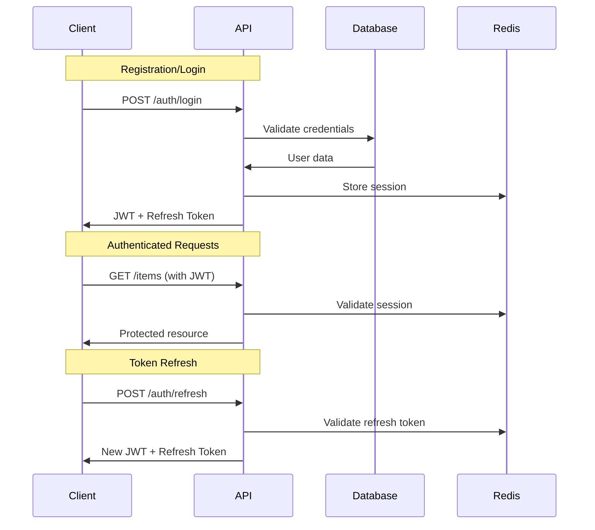

# Tracktory API Specifications

_Last Updated: September 3, 2025_

## API Overview

The Tracktory API is a RESTful service built with Go that provides secure, performant endpoints for asset tracking functionality. The API prioritizes mobile performance with efficient data serialization and optimized response times.

## Base Configuration

**Base URL**: `https://api.tracktory.app`  
**Version**: `v1`  
**Content Type**: `application/json`  
**Authentication**: JWT Bearer tokens

## Authentication

### Authentication Flow



### Authentication Endpoints

#### POST /api/auth/register

Register a new user account.

**Request:**

```json
{
  "email": "user@example.com",
  "password": "securePassword123",
  "name": "John Doe"
}
```

**Response (201):**

```json
{
  "success": true,
  "data": {
    "user": {
      "id": "550e8400-e29b-41d4-a716-446655440000",
      "email": "user@example.com",
      "name": "John Doe",
      "created_at": "2025-09-03T10:00:00Z"
    },
    "access_token": "eyJhbGciOiJIUzI1NiIsInR5cCI6IkpXVCJ9...",
    "refresh_token": "eyJhbGciOiJIUzI1NiIsInR5cCI6IkpXVCJ9...",
    "expires_in": 900
  },
  "meta": {
    "timestamp": "2025-09-03T10:00:00Z",
    "version": "1.0"
  }
}
```

**Validation Rules:**

- Email must be valid format and unique
- Password minimum 8 characters, must contain uppercase, lowercase, and number
- Name must be 2-50 characters

#### POST /api/auth/login

Authenticate existing user.

**Request:**

```json
{
  "email": "user@example.com",
  "password": "securePassword123"
}
```

**Response (200):** Same as registration response

**Error Response (401):**

```json
{
  "success": false,
  "error": {
    "code": "INVALID_CREDENTIALS",
    "message": "Invalid email or password"
  },
  "meta": {
    "timestamp": "2025-09-03T10:00:00Z",
    "request_id": "req_123456789"
  }
}
```

#### POST /api/auth/refresh

Refresh access token using refresh token.

**Request:**

```json
{
  "refresh_token": "eyJhbGciOiJIUzI1NiIsInR5cCI6IkpXVCJ9..."
}
```

**Response (200):**

```json
{
  "success": true,
  "data": {
    "access_token": "eyJhbGciOiJIUzI1NiIsInR5cCI6IkpXVCJ9...",
    "refresh_token": "eyJhbGciOiJIUzI1NiIsInR5cCI6IkpXVCJ9...",
    "expires_in": 900
  }
}
```

#### POST /api/auth/logout

Invalidate current session.

**Headers:** `Authorization: Bearer {access_token}`

**Response (200):**

```json
{
  "success": true,
  "data": {
    "message": "Successfully logged out"
  }
}
```

---

## Items API

### Core Item Operations

#### GET /api/items

List user's items with filtering and pagination.

**Headers:** `Authorization: Bearer {access_token}`

**Query Parameters:**

- `page` (integer, default: 1): Page number
- `limit` (integer, default: 20, max: 100): Items per page
- `category` (string): Filter by category ID
- `location` (string): Filter by location ID
- `status` (string): Filter by status (active, sold, lost, donated)
- `sort` (string): Sort field (name, created_at, updated_at)
- `order` (string): Sort order (asc, desc)

**Response (200):**

```json
{
  "success": true,
  "data": {
    "items": [
      {
        "id": "550e8400-e29b-41d4-a716-446655440000",
        "name": "MacBook Pro 16-inch",
        "description": "2023 MacBook Pro with M2 chip",
        "category": {
          "id": "cat_electronics",
          "name": "Electronics",
          "icon": "laptop"
        },
        "location": {
          "id": "loc_office",
          "name": "Home Office"
        },
        "purchase_price": 2499.0,
        "purchase_date": "2023-06-15",
        "status": "active",
        "condition": "excellent",
        "images": [
          {
            "id": "img_001",
            "thumbnail_url": "https://cdn.tracktory.app/images/thumb_150.webp",
            "display_url": "https://cdn.tracktory.app/images/display_800.webp",
            "detail_url": "https://cdn.tracktory.app/images/detail_1600.webp"
          }
        ],
        "created_at": "2025-09-01T10:00:00Z",
        "updated_at": "2025-09-01T10:00:00Z"
      }
    ]
  },
  "meta": {
    "timestamp": "2025-09-03T10:00:00Z",
    "version": "1.0",
    "pagination": {
      "page": 1,
      "limit": 20,
      "total": 150,
      "total_pages": 8,
      "has_more": true
    }
  }
}
```

#### POST /api/items

Create a new item.

**Headers:**

- `Authorization: Bearer {access_token}`
- `Content-Type: multipart/form-data` (if including images)

**Request:**

```json
{
  "name": "Vintage Guitar",
  "description": "1973 Fender Stratocaster in excellent condition",
  "category_id": "cat_instruments",
  "location_id": "loc_music_room",
  "purchase_price": 3500.0,
  "purchase_date": "2023-08-20",
  "condition": "excellent",
  "status": "active"
}
```

**Response (201):**

```json
{
  "success": true,
  "data": {
    "item": {
      "id": "550e8400-e29b-41d4-a716-446655440001",
      "name": "Vintage Guitar",
      "description": "1973 Fender Stratocaster in excellent condition",
      "category": {
        "id": "cat_instruments",
        "name": "Musical Instruments",
        "icon": "music"
      },
      "location": {
        "id": "loc_music_room",
        "name": "Music Room"
      },
      "purchase_price": 3500.0,
      "purchase_date": "2023-08-20",
      "status": "active",
      "condition": "excellent",
      "images": [],
      "created_at": "2025-09-03T10:00:00Z",
      "updated_at": "2025-09-03T10:00:00Z"
    }
  }
}
```

**Validation Rules:**

- `name`: Required, 1-255 characters
- `description`: Optional, max 2000 characters
- `category_id`: Must be valid category ID
- `location_id`: Must be valid location ID for user
- `purchase_price`: Optional, positive decimal
- `purchase_date`: Optional, valid date format
- `condition`: Must be one of: excellent, good, fair, poor
- `status`: Must be one of: active, sold, lost, donated

#### GET /api/items/{id}

Get detailed item information.

**Headers:** `Authorization: Bearer {access_token}`

**Response (200):**

```json
{
  "success": true,
  "data": {
    "item": {
      "id": "550e8400-e29b-41d4-a716-446655440000",
      "name": "MacBook Pro 16-inch",
      "description": "2023 MacBook Pro with M2 chip, used for development work",
      "category": {
        "id": "cat_electronics",
        "name": "Electronics",
        "icon": "laptop"
      },
      "location": {
        "id": "loc_office",
        "name": "Home Office",
        "description": "Main workspace"
      },
      "purchase_price": 2499.0,
      "purchase_date": "2023-06-15",
      "status": "active",
      "condition": "excellent",
      "images": [
        {
          "id": "img_001",
          "thumbnail_url": "https://cdn.tracktory.app/images/thumb_150.webp",
          "display_url": "https://cdn.tracktory.app/images/display_800.webp",
          "detail_url": "https://cdn.tracktory.app/images/detail_1600.webp",
          "metadata": {
            "width": 1600,
            "height": 1200,
            "size": 245760,
            "format": "webp"
          }
        }
      ],
      "history": [
        {
          "id": "hist_001",
          "action": "created",
          "timestamp": "2025-09-01T10:00:00Z",
          "user": {
            "id": "user_001",
            "name": "John Doe"
          }
        }
      ],
      "created_at": "2025-09-01T10:00:00Z",
      "updated_at": "2025-09-01T10:00:00Z"
    }
  }
}
```

#### PUT /api/items/{id}

Update an existing item.

**Headers:**

- `Authorization: Bearer {access_token}`
- `Content-Type: application/json`

**Request:**

```json
{
  "name": "MacBook Pro 16-inch (Updated)",
  "description": "2023 MacBook Pro with M2 chip, excellent for development",
  "condition": "good",
  "purchase_price": 2499.0
}
```

**Response (200):** Same structure as GET /api/items/{id}

#### DELETE /api/items/{id}

Delete an item (soft delete).

**Headers:** `Authorization: Bearer {access_token}`

**Response (200):**

```json
{
  "success": true,
  "data": {
    "message": "Item successfully deleted"
  }
}
```

### Image Management

#### POST /api/items/{id}/images

Upload images for an item.

**Headers:**

- `Authorization: Bearer {access_token}`
- `Content-Type: multipart/form-data`

**Request:**

```
POST /api/items/550e8400-e29b-41d4-a716-446655440000/images
Content-Type: multipart/form-data

--boundary
Content-Disposition: form-data; name="images"; filename="laptop.jpg"
Content-Type: image/jpeg

[binary image data]
--boundary
```

**Response (201):**

```json
{
  "success": true,
  "data": {
    "images": [
      {
        "id": "img_002",
        "thumbnail_url": "https://cdn.tracktory.app/images/thumb_150.webp",
        "display_url": "https://cdn.tracktory.app/images/display_800.webp",
        "detail_url": "https://cdn.tracktory.app/images/detail_1600.webp",
        "metadata": {
          "original_filename": "laptop.jpg",
          "width": 1600,
          "height": 1200,
          "size": 245760,
          "format": "webp"
        }
      }
    ]
  }
}
```

**Validation Rules:**

- Maximum 5 images per item
- Supported formats: JPEG, PNG, WebP
- Maximum file size: 10MB per image
- Maximum dimensions: 2048x2048 pixels

#### DELETE /api/items/{id}/images/{image_id}

Delete an image from an item.

**Headers:** `Authorization: Bearer {access_token}`

**Response (200):**

```json
{
  "success": true,
  "data": {
    "message": "Image successfully deleted"
  }
}
```

---

## Search API

### Search Functionality

#### GET /api/search

Search items with full-text search and filtering.

**Headers:** `Authorization: Bearer {access_token}`

**Query Parameters:**

- `q` (string): Search query
- `categories` (string[]): Filter by category IDs
- `locations` (string[]): Filter by location IDs
- `status` (string[]): Filter by status values
- `condition` (string[]): Filter by condition values
- `price_min` (number): Minimum purchase price
- `price_max` (number): Maximum purchase price
- `date_from` (string): Earliest purchase date (ISO format)
- `date_to` (string): Latest purchase date (ISO format)
- `limit` (integer, default: 20, max: 100): Results per page
- `offset` (integer, default: 0): Result offset

**Example Request:**

```
GET /api/search?q=macbook&categories=cat_electronics&price_min=1000&limit=10
```

**Response (200):**

```json
{
  "success": true,
  "data": {
    "results": [
      {
        "id": "550e8400-e29b-41d4-a716-446655440000",
        "name": "MacBook Pro 16-inch",
        "description": "2023 MacBook Pro with M2 chip",
        "category": {
          "id": "cat_electronics",
          "name": "Electronics",
          "icon": "laptop"
        },
        "location": {
          "id": "loc_office",
          "name": "Home Office"
        },
        "purchase_price": 2499.0,
        "status": "active",
        "condition": "excellent",
        "thumbnail": "https://cdn.tracktory.app/images/thumb_150.webp",
        "relevance_score": 0.95,
        "created_at": "2025-09-01T10:00:00Z"
      }
    ],
    "query_info": {
      "query": "macbook",
      "total_results": 3,
      "search_time_ms": 15,
      "suggestions": ["macbook pro", "macbook air"]
    }
  },
  "meta": {
    "timestamp": "2025-09-03T10:00:00Z",
    "version": "1.0",
    "pagination": {
      "limit": 10,
      "offset": 0,
      "total": 3,
      "has_more": false
    }
  }
}
```

#### GET /api/search/suggestions

Get search suggestions and auto-completion.

**Headers:** `Authorization: Bearer {access_token}`

**Query Parameters:**

- `q` (string): Partial search query
- `limit` (integer, default: 10, max: 20): Number of suggestions

**Response (200):**

```json
{
  "success": true,
  "data": {
    "suggestions": [
      {
        "text": "macbook pro",
        "type": "item_name",
        "count": 2
      },
      {
        "text": "macbook air",
        "type": "item_name",
        "count": 1
      },
      {
        "text": "Electronics",
        "type": "category",
        "count": 15
      }
    ]
  }
}
```

#### GET /api/search/filters

Get available filter options for search.

**Headers:** `Authorization: Bearer {access_token}`

**Response (200):**

```json
{
  "success": true,
  "data": {
    "filters": {
      "categories": [
        {
          "id": "cat_electronics",
          "name": "Electronics",
          "icon": "laptop",
          "count": 15
        },
        {
          "id": "cat_furniture",
          "name": "Furniture",
          "icon": "chair",
          "count": 8
        }
      ],
      "locations": [
        {
          "id": "loc_office",
          "name": "Home Office",
          "count": 12
        },
        {
          "id": "loc_bedroom",
          "name": "Bedroom",
          "count": 6
        }
      ],
      "status_options": [
        { "value": "active", "label": "Active", "count": 45 },
        { "value": "sold", "label": "Sold", "count": 3 },
        { "value": "lost", "label": "Lost", "count": 1 }
      ],
      "condition_options": [
        { "value": "excellent", "label": "Excellent", "count": 20 },
        { "value": "good", "label": "Good", "count": 18 },
        { "value": "fair", "label": "Fair", "count": 8 },
        { "value": "poor", "label": "Poor", "count": 3 }
      ],
      "price_range": {
        "min": 5.0,
        "max": 5000.0,
        "avg": 287.5
      }
    }
  }
}
```

---

## Categories API

### Category Management

#### GET /api/categories

Get all available categories.

**Headers:** `Authorization: Bearer {access_token}`

**Response (200):**

```json
{
  "success": true,
  "data": {
    "categories": [
      {
        "id": "cat_electronics",
        "name": "Electronics",
        "icon": "laptop",
        "parent_id": null,
        "sort_order": 1,
        "item_count": 15,
        "children": [
          {
            "id": "cat_computers",
            "name": "Computers",
            "icon": "desktop",
            "parent_id": "cat_electronics",
            "sort_order": 1,
            "item_count": 8
          }
        ]
      },
      {
        "id": "cat_furniture",
        "name": "Furniture",
        "icon": "chair",
        "parent_id": null,
        "sort_order": 2,
        "item_count": 12,
        "children": []
      }
    ]
  }
}
```

#### POST /api/categories

Create a custom category (Phase 2 feature).

**Headers:**

- `Authorization: Bearer {access_token}`
- `Content-Type: application/json`

**Request:**

```json
{
  "name": "Collectibles",
  "icon": "star",
  "parent_id": null
}
```

**Response (201):**

```json
{
  "success": true,
  "data": {
    "category": {
      "id": "cat_custom_001",
      "name": "Collectibles",
      "icon": "star",
      "parent_id": null,
      "sort_order": 100,
      "item_count": 0,
      "is_custom": true
    }
  }
}
```

---

## Locations API

### Location Management

#### GET /api/locations

Get user's locations.

**Headers:** `Authorization: Bearer {access_token}`

**Response (200):**

```json
{
  "success": true,
  "data": {
    "locations": [
      {
        "id": "loc_office",
        "name": "Home Office",
        "description": "Main workspace and computer setup",
        "parent_id": null,
        "sort_order": 1,
        "item_count": 12,
        "children": [
          {
            "id": "loc_office_desk",
            "name": "Desk",
            "description": "Main desk area",
            "parent_id": "loc_office",
            "sort_order": 1,
            "item_count": 5
          }
        ]
      }
    ]
  }
}
```

#### POST /api/locations

Create a new location.

**Headers:**

- `Authorization: Bearer {access_token}`
- `Content-Type: application/json`

**Request:**

```json
{
  "name": "Garage",
  "description": "Storage area for tools and equipment",
  "parent_id": null
}
```

**Response (201):**

```json
{
  "success": true,
  "data": {
    "location": {
      "id": "loc_garage",
      "name": "Garage",
      "description": "Storage area for tools and equipment",
      "parent_id": null,
      "sort_order": 10,
      "item_count": 0
    }
  }
}
```

#### PUT /api/locations/{id}

Update a location.

**Request:**

```json
{
  "name": "Garage Workshop",
  "description": "Workshop area with tools and workbench"
}
```

**Response (200):** Same structure as POST response

#### DELETE /api/locations/{id}

Delete a location (only if no items assigned).

**Response (200):**

```json
{
  "success": true,
  "data": {
    "message": "Location successfully deleted"
  }
}
```

---

## User API

### User Profile Management

#### GET /api/users/profile

Get current user profile.

**Headers:** `Authorization: Bearer {access_token}`

**Response (200):**

```json
{
  "success": true,
  "data": {
    "user": {
      "id": "550e8400-e29b-41d4-a716-446655440000",
      "email": "user@example.com",
      "name": "John Doe",
      "preferences": {
        "default_currency": "USD",
        "date_format": "MM/DD/YYYY",
        "theme": "auto",
        "notifications": {
          "email": true,
          "push": false
        }
      },
      "statistics": {
        "total_items": 45,
        "total_value": 15750.0,
        "items_by_category": {
          "Electronics": 15,
          "Furniture": 12,
          "Tools": 8,
          "Clothing": 10
        },
        "recent_additions": 3
      },
      "created_at": "2025-08-01T10:00:00Z",
      "updated_at": "2025-09-01T15:30:00Z"
    }
  }
}
```

#### PUT /api/users/profile

Update user profile.

**Headers:**

- `Authorization: Bearer {access_token}`
- `Content-Type: application/json`

**Request:**

```json
{
  "name": "John Smith",
  "preferences": {
    "default_currency": "EUR",
    "theme": "dark",
    "notifications": {
      "email": false,
      "push": true
    }
  }
}
```

**Response (200):** Same structure as GET profile response

#### POST /api/users/change-password

Change user password.

**Headers:**

- `Authorization: Bearer {access_token}`
- `Content-Type: application/json`

**Request:**

```json
{
  "current_password": "currentPassword123",
  "new_password": "newSecurePassword456"
}
```

**Response (200):**

```json
{
  "success": true,
  "data": {
    "message": "Password successfully updated"
  }
}
```

---

## Export API

### Data Export

#### GET /api/export/items

Export user's items in various formats.

**Headers:** `Authorization: Bearer {access_token}`

**Query Parameters:**

- `format` (string): Export format (json, csv, pdf)
- `include_images` (boolean): Include image URLs in export
- `categories` (string[]): Filter by category IDs
- `status` (string[]): Filter by status values

**Response (200) - JSON Format:**

```json
{
  "success": true,
  "data": {
    "export": {
      "format": "json",
      "generated_at": "2025-09-03T10:00:00Z",
      "total_items": 45,
      "items": [
        {
          "id": "550e8400-e29b-41d4-a716-446655440000",
          "name": "MacBook Pro 16-inch",
          "description": "2023 MacBook Pro with M2 chip",
          "category": "Electronics",
          "location": "Home Office",
          "purchase_price": 2499.0,
          "purchase_date": "2023-06-15",
          "status": "active",
          "condition": "excellent",
          "images": ["https://cdn.tracktory.app/images/detail_1600.webp"],
          "created_at": "2025-09-01T10:00:00Z"
        }
      ]
    }
  }
}
```

**Response (200) - CSV Format:**

```
Content-Type: text/csv
Content-Disposition: attachment; filename="tracktory-export-2025-09-03.csv"

ID,Name,Description,Category,Location,Purchase Price,Purchase Date,Status,Condition,Created At
550e8400-e29b-41d4-a716-446655440000,MacBook Pro 16-inch,2023 MacBook Pro with M2 chip,Electronics,Home Office,2499.00,2023-06-15,active,excellent,2025-09-01T10:00:00Z
```

---

## Error Handling

### Standard Error Response Format

All API errors follow a consistent format:

```json
{
  "success": false,
  "error": {
    "code": "ERROR_CODE",
    "message": "Human-readable error message",
    "details": {
      "field": ["Specific validation error"]
    }
  },
  "meta": {
    "timestamp": "2025-09-03T10:00:00Z",
    "request_id": "req_123456789"
  }
}
```

### Common Error Codes

#### Authentication Errors (401)

- `INVALID_CREDENTIALS`: Invalid email/password combination
- `TOKEN_EXPIRED`: Access token has expired
- `TOKEN_INVALID`: Malformed or invalid token
- `SESSION_EXPIRED`: User session has expired

#### Authorization Errors (403)

- `INSUFFICIENT_PERMISSIONS`: User lacks required permissions
- `RESOURCE_ACCESS_DENIED`: Cannot access requested resource
- `ACCOUNT_SUSPENDED`: User account is suspended

#### Validation Errors (400)

- `VALIDATION_ERROR`: Request data validation failed
- `INVALID_FORMAT`: Data format is incorrect
- `MISSING_REQUIRED_FIELD`: Required field is missing
- `FIELD_TOO_LONG`: Field exceeds maximum length

#### Resource Errors (404)

- `RESOURCE_NOT_FOUND`: Requested resource doesn't exist
- `ITEM_NOT_FOUND`: Specific item not found
- `USER_NOT_FOUND`: User account not found

#### Server Errors (500)

- `INTERNAL_SERVER_ERROR`: Unexpected server error
- `DATABASE_ERROR`: Database operation failed
- `EXTERNAL_SERVICE_ERROR`: External service unavailable

### Rate Limiting

API requests are rate limited per user:

- **Authentication endpoints**: 5 requests per minute
- **Read operations**: 100 requests per minute
- **Write operations**: 50 requests per minute
- **Image uploads**: 10 requests per minute

Rate limit headers are included in all responses:

```
X-RateLimit-Limit: 100
X-RateLimit-Remaining: 95
X-RateLimit-Reset: 1693747200
```

When rate limit is exceeded (429):

```json
{
  "success": false,
  "error": {
    "code": "RATE_LIMIT_EXCEEDED",
    "message": "Too many requests. Please try again later.",
    "details": {
      "limit": 100,
      "reset_at": "2025-09-03T10:15:00Z"
    }
  }
}
```

---

## API Performance Standards

### Response Time Targets

- **Authentication**: < 200ms average
- **Item CRUD operations**: < 150ms average
- **Search operations**: < 300ms average
- **Image upload**: < 2s for 5MB image
- **List operations**: < 100ms average

### Data Transfer Optimization

- **Compression**: gzip compression for all responses
- **Pagination**: Maximum 100 items per request
- **Field Selection**: Support for field filtering (future)
- **ETags**: Caching headers for unchanged resources

### Mobile Optimization

- **Minimal Payloads**: Only essential data in responses
- **Image Optimization**: Multiple resolutions available
- **Offline Support**: Graceful degradation for connectivity issues
- **Progressive Loading**: Support for incremental data loading

---

This API specification provides comprehensive documentation for building a mobile-optimized, secure, and performant asset tracking API that aligns with Tracktory's strategic vision and technical requirements.
