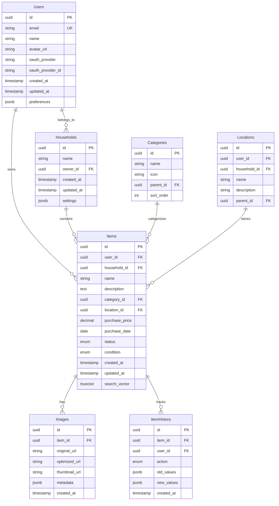

# Database Schema Specification

This document is the single source of truth for the Tracktory database schema. All other documents should reference this file for schema details.

## Overview

- Database: PostgreSQL 15+
- Multi-tenancy: Single database with Row Level Security (RLS)
- Identity: OAuth-only (per ADR-003), no password storage

## Entity-Relationship Overview (Detailed)



## Tables

### users

```sql
-- Core user table (OAuth-only authentication per ADR-003)
CREATE TABLE users (
    id UUID PRIMARY KEY DEFAULT gen_random_uuid(),
    email VARCHAR(255) UNIQUE NOT NULL,
    name VARCHAR(100) NOT NULL,
    avatar_url VARCHAR(500),
    oauth_provider VARCHAR(20) NOT NULL, -- google, github
    oauth_provider_id VARCHAR(100) NOT NULL,
    created_at TIMESTAMP WITH TIME ZONE DEFAULT NOW(),
    updated_at TIMESTAMP WITH TIME ZONE DEFAULT NOW(),
    preferences JSONB DEFAULT '{}'::jsonb,
    UNIQUE(oauth_provider, oauth_provider_id)
);
```

### households

```sql
CREATE TABLE households (
    id UUID PRIMARY KEY DEFAULT gen_random_uuid(),
    name VARCHAR(100) NOT NULL,
    owner_id UUID NOT NULL REFERENCES users(id),
    created_at TIMESTAMP WITH TIME ZONE DEFAULT NOW(),
    updated_at TIMESTAMP WITH TIME ZONE DEFAULT NOW(),
    settings JSONB DEFAULT '{}'::jsonb
);
```

### household_members

```sql
CREATE TABLE household_members (
    id UUID PRIMARY KEY DEFAULT gen_random_uuid(),
    household_id UUID NOT NULL REFERENCES households(id) ON DELETE CASCADE,
    user_id UUID NOT NULL REFERENCES users(id) ON DELETE CASCADE,
    role VARCHAR(20) NOT NULL DEFAULT 'member', -- owner, admin, member, viewer
    joined_at TIMESTAMP WITH TIME ZONE DEFAULT NOW(),
    UNIQUE(household_id, user_id)
);
```

### categories

```sql
CREATE TABLE categories (
    id UUID PRIMARY KEY DEFAULT gen_random_uuid(),
    user_id UUID REFERENCES users(id),
    household_id UUID REFERENCES households(id),
    name VARCHAR(100) NOT NULL,
    icon VARCHAR(100),
    parent_id UUID REFERENCES categories(id),
    sort_order INT DEFAULT 0
);
```

### locations

```sql
CREATE TABLE locations (
    id UUID PRIMARY KEY DEFAULT gen_random_uuid(),
    user_id UUID REFERENCES users(id),
    household_id UUID REFERENCES households(id),
    name VARCHAR(100) NOT NULL,
    description TEXT,
    parent_id UUID REFERENCES locations(id)
);
```

### items

```sql
CREATE TABLE items (
    id UUID PRIMARY KEY DEFAULT gen_random_uuid(),
    user_id UUID NOT NULL REFERENCES users(id),
    household_id UUID REFERENCES households(id),
    name VARCHAR(255) NOT NULL,
    description TEXT,
    category_id UUID REFERENCES categories(id),
    location_id UUID REFERENCES locations(id),
    purchase_price DECIMAL(10,2),
    purchase_date DATE,
    status VARCHAR(20) DEFAULT 'active', -- active, sold, lost, donated
    condition VARCHAR(20) DEFAULT 'excellent', -- excellent, good, fair, poor
    created_at TIMESTAMP WITH TIME ZONE DEFAULT NOW(),
    updated_at TIMESTAMP WITH TIME ZONE DEFAULT NOW(),
    search_vector tsvector
);
```

### images

```sql
CREATE TABLE images (
    id UUID PRIMARY KEY DEFAULT gen_random_uuid(),
    item_id UUID NOT NULL REFERENCES items(id) ON DELETE CASCADE,
    original_url TEXT NOT NULL,
    optimized_url TEXT,
    thumbnail_url TEXT,
    metadata JSONB DEFAULT '{}'::jsonb,
    created_at TIMESTAMP WITH TIME ZONE DEFAULT NOW()
);
```

### item_history

```sql
CREATE TABLE item_history (
    id UUID PRIMARY KEY DEFAULT gen_random_uuid(),
    item_id UUID NOT NULL REFERENCES items(id) ON DELETE CASCADE,
    user_id UUID NOT NULL REFERENCES users(id),
    action VARCHAR(30) NOT NULL, -- created, updated, deleted, moved, etc.
    old_values JSONB,
    new_values JSONB,
    created_at TIMESTAMP WITH TIME ZONE DEFAULT NOW()
);
```

## Indexing Strategy

```sql
-- Core performance indexes
CREATE INDEX idx_items_user_id ON items(user_id);
CREATE INDEX idx_items_household_id ON items(household_id);
CREATE INDEX idx_items_search ON items USING gin(search_vector);
CREATE INDEX idx_items_status ON items(status) WHERE status != 'active';

-- Composite indexes for common queries
CREATE INDEX idx_items_user_created ON items(user_id, created_at DESC);
CREATE INDEX idx_items_category_user ON items(category_id, user_id);
```

## Search Vector and Triggers

```sql
CREATE EXTENSION IF NOT EXISTS pg_trgm;

CREATE OR REPLACE FUNCTION update_item_search_vector()
RETURNS TRIGGER AS $$
BEGIN
    NEW.search_vector :=
        setweight(to_tsvector('english', COALESCE(NEW.name, '')), 'A') ||
        setweight(to_tsvector('english', COALESCE(NEW.description, '')), 'B') ||
        setweight(to_tsvector('english', COALESCE((SELECT name FROM categories WHERE id = NEW.category_id), '')), 'C');
    RETURN NEW;
END;
$$ LANGUAGE plpgsql;

CREATE TRIGGER item_search_vector_update
    BEFORE INSERT OR UPDATE ON items
    FOR EACH ROW EXECUTE FUNCTION update_item_search_vector();
```

## Row Level Security (RLS)

```sql
ALTER TABLE items ENABLE ROW LEVEL SECURITY;

CREATE POLICY items_user_policy ON items
    FOR ALL TO authenticated_users
    USING (user_id = current_user_id());

CREATE POLICY items_household_policy ON items
    FOR ALL TO authenticated_users
    USING (
        household_id IN (
            SELECT household_id
            FROM household_members
            WHERE user_id = current_user_id()
        )
    );
```

## Notes

- This document is referenced by [system-design.md](../system-design.md) and ADRs (e.g., [ADR-004](../technical-decisions/adr-004-database-design.md)).
- Update this file first when making schema changes.
- Keep diagrams in sync with table definitions.
