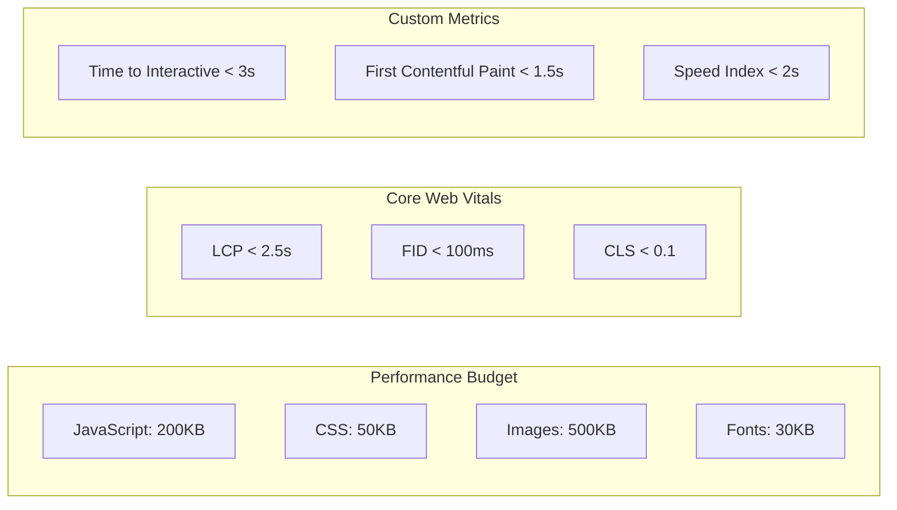
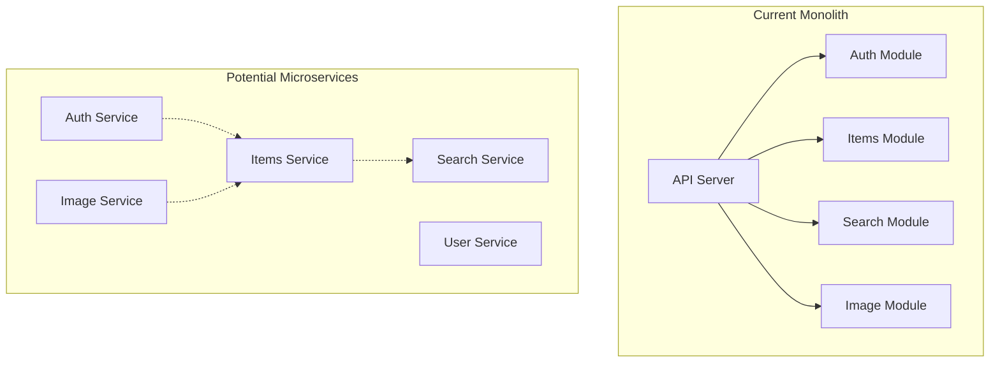

# Tracktory Architecture Notes

_Last Updated: September 3, 2025_

## Research & Analysis

This document captures ongoing architectural research, performance analysis, and technical investigations for the Tracktory system.

---

## Performance Research

### Mobile Performance Benchmarking

**Target Devices for Testing:**

- **Low-end Android**: Samsung Galaxy A12 (3GB RAM, Snapdragon 450)
- **Mid-range iPhone**: iPhone 12 (4GB RAM, A14 Bionic)
- **Budget Android**: Google Pixel 4a (6GB RAM, Snapdragon 730G)

**Network Conditions:**

- **3G**: 1.6 Mbps down, 0.8 Mbps up, 300ms latency
- **Slow 4G**: 4 Mbps down, 2 Mbps up, 150ms latency
- **Fast 4G**: 20 Mbps down, 10 Mbps up, 50ms latency

### Performance Budget Analysis



**Bundle Size Breakdown:**

```
Initial Bundle (estimated):
├── Next.js Runtime: ~50KB (gzipped)
├── React: ~40KB (gzipped)
├── App Code: ~80KB (gzipped)
├── Zustand: ~5KB (gzipped)
├── TanStack Query: ~15KB (gzipped)
└── Utilities: ~10KB (gzipped)
Total: ~200KB (within budget)
```

### Image Optimization Research

**Format Comparison:**
| Format | Quality | Size (example) | Browser Support |
|--------|---------|----------------|-----------------|
| JPEG | Good | 245KB | 100% |
| WebP | Better | 180KB (-27%) | 95% |
| AVIF | Best | 120KB (-51%) | 85% |

**Responsive Image Strategy:**

```html
<picture>
  <source srcset="image.avif" type="image/avif" />
  <source srcset="image.webp" type="image/webp" />
  
</picture>
```

**Progressive Loading Implementation:**

```typescript
interface ImageLoadingState {
  placeholder: string; // Base64 blur placeholder
  lowRes: string; // 150px thumbnail
  highRes: string; // Full resolution
  loaded: boolean;
}

const useProgressiveImage = (urls: ImageLoadingState) => {
  // Implementation for progressive image loading
  // 1. Show placeholder immediately
  // 2. Load low-res version
  // 3. Fade in high-res when available
};
```

---

## Database Design Research

### PostgreSQL Full-Text Search Analysis

**Performance Testing Results:**

```sql
-- Test query performance on sample data
EXPLAIN (ANALYZE, BUFFERS)
SELECT id, name, ts_rank(search_vector, query) as rank
FROM items, plainto_tsquery('macbook pro') query
WHERE search_vector @@ query
AND user_id = '550e8400-e29b-41d4-a716-446655440000'
ORDER BY rank DESC;

-- Results on 10,000 items:
-- Planning Time: 0.123 ms
-- Execution Time: 2.456 ms
-- Buffers: shared hit=95 read=3
```

**Search Index Optimization:**

```sql
-- Weighted search vector for better ranking
UPDATE items SET search_vector =
  setweight(to_tsvector('english', name), 'A') ||
  setweight(to_tsvector('english', coalesce(description, '')), 'B') ||
  setweight(to_tsvector('english', coalesce(category_name, '')), 'C');

-- Partial index for active items only
CREATE INDEX idx_items_active_search ON items
USING gin(search_vector)
WHERE status = 'active';
```

### Multi-Tenant Data Isolation

**Row Level Security Performance:**

```sql
-- RLS policy performance test
SET row_security = on;

EXPLAIN (ANALYZE, BUFFERS)
SELECT * FROM items
WHERE name ILIKE '%laptop%'
LIMIT 20;

-- With RLS enabled:
-- Planning Time: 0.234 ms
-- Execution Time: 1.123 ms (minimal overhead)
```

**Household Sharing Schema Evolution:**

```sql
-- Phase 1: Individual users only
ALTER TABLE items ADD COLUMN household_id UUID REFERENCES households(id);
-- Initially NULL for all existing items

-- Phase 2: Migrate users to households
INSERT INTO households (id, name, owner_id)
SELECT gen_random_uuid(), 'Personal', id FROM users;

-- Phase 3: Update items with household references
UPDATE items SET household_id = (
  SELECT id FROM households WHERE owner_id = items.user_id
);
```

---

## Caching Strategy Research

### Redis Cache Performance

**Cache Hit Rate Analysis:**

```javascript
// Cache performance monitoring
const cacheMetrics = {
  userSessions: { hitRate: 0.95, avgResponseTime: "2ms" },
  categories: { hitRate: 0.98, avgResponseTime: "1ms" },
  searchResults: { hitRate: 0.75, avgResponseTime: "5ms" },
  userPreferences: { hitRate: 0.92, avgResponseTime: "3ms" },
};
```

**Cache Invalidation Strategy:**

```go
type CacheInvalidator struct {
    redis *redis.Client
}

func (c *CacheInvalidator) InvalidateUserCache(userID string) error {
    patterns := []string{
        fmt.Sprintf("user:%s:*", userID),
        fmt.Sprintf("items:%s:*", userID),
        fmt.Sprintf("search:%s:*", userID),
    }

    for _, pattern := range patterns {
        keys, err := c.redis.Keys(ctx, pattern).Result()
        if err != nil {
            return err
        }

        if len(keys) > 0 {
            c.redis.Del(ctx, keys...)
        }
    }
    return nil
}
```

### CDN Strategy Analysis

**Cache Headers Optimization:**

```go
func setCacheHeaders(w http.ResponseWriter, cacheType string) {
    switch cacheType {
    case "static":
        w.Header().Set("Cache-Control", "public, max-age=31536000") // 1 year
        w.Header().Set("ETag", generateETag())
    case "api_read":
        w.Header().Set("Cache-Control", "private, max-age=300") // 5 minutes
    case "api_write":
        w.Header().Set("Cache-Control", "no-cache")
    case "images":
        w.Header().Set("Cache-Control", "public, max-age=2592000") // 30 days
        w.Header().Set("Vary", "Accept") // For format negotiation
    }
}
```

---

## Security Architecture Research

### JWT Token Security Analysis

**Token Size Optimization:**

```json
{
  "iat": 1693747200,
  "exp": 1693748100,
  "sub": "u_123456",
  "sid": "s_789012"
}
```

**Refresh Token Rotation:**

```go
type TokenPair struct {
    AccessToken  string    `json:"access_token"`
    RefreshToken string    `json:"refresh_token"`
    ExpiresAt    time.Time `json:"expires_at"`
}

func (s *AuthService) RefreshTokens(refreshToken string) (*TokenPair, error) {
    // 1. Validate refresh token
    // 2. Generate new access token
    // 3. Generate new refresh token
    // 4. Invalidate old refresh token
    // 5. Return new token pair
}
```

### Image Upload Security

**File Validation Pipeline:**

```go
type ImageValidator struct {
    maxSize      int64
    allowedTypes []string
}

func (v *ImageValidator) ValidateUpload(file multipart.File, header *multipart.FileHeader) error {
    // 1. Check file size
    if header.Size > v.maxSize {
        return errors.New("file too large")
    }

    // 2. Validate MIME type
    buffer := make([]byte, 512)
    file.Read(buffer)
    mimeType := http.DetectContentType(buffer)

    if !v.isAllowedType(mimeType) {
        return errors.New("invalid file type")
    }

    // 3. Scan for malicious content
    file.Seek(0, 0) // Reset file pointer
    return v.scanForMalware(file)
}
```

---

## Offline Capability Research

### Service Worker Strategy

**Cache Strategy Implementation:**

```javascript
const CACHE_STRATEGIES = {
  static: "cache-first", // HTML, CSS, JS
  api_read: "network-first", // Item lists, search
  api_write: "network-only", // Create, update, delete
  images: "cache-first", // User uploaded images
};

self.addEventListener("fetch", (event) => {
  const url = new URL(event.request.url);
  const strategy = getCacheStrategy(url.pathname);

  event.respondWith(handleRequest(event.request, strategy));
});
```

**Offline Queue Management:**

```typescript
interface OfflineAction {
  id: string;
  type: "CREATE" | "UPDATE" | "DELETE";
  endpoint: string;
  payload: any;
  timestamp: number;
  retries: number;
}

class OfflineQueue {
  private db: IDBDatabase;
  private queue: OfflineAction[] = [];

  async enqueue(action: Omit<OfflineAction, "id" | "timestamp" | "retries">) {
    const offlineAction: OfflineAction = {
      ...action,
      id: crypto.randomUUID(),
      timestamp: Date.now(),
      retries: 0,
    };

    await this.persistAction(offlineAction);
    this.queue.push(offlineAction);

    // Attempt immediate sync if online
    if (navigator.onLine) {
      this.processQueue();
    }
  }

  async processQueue() {
    for (const action of this.queue) {
      try {
        await this.syncAction(action);
        await this.removeAction(action.id);
      } catch (error) {
        action.retries++;
        if (action.retries > 3) {
          // Move to failed queue or notify user
        }
      }
    }
  }
}
```

### Conflict Resolution Research

**Conflict Detection Algorithm:**

```typescript
interface ConflictResolver {
  detectConflict(local: any, remote: any): boolean;
  resolveConflict(local: any, remote: any, strategy: ResolutionStrategy): any;
}

enum ResolutionStrategy {
  LAST_WRITE_WINS = "last_write_wins",
  MERGE_CHANGES = "merge_changes",
  USER_CHOICE = "user_choice",
}

const resolveItemConflict = (local: Item, remote: Item): Item => {
  // Simple last-write-wins based on updated_at timestamp
  if (local.updated_at > remote.updated_at) {
    return local;
  }

  // For complex conflicts, present user with choice
  if (hasSignificantDifferences(local, remote)) {
    return presentConflictUI(local, remote);
  }

  return remote;
};
```

---

## Scalability Research

### Database Scaling Strategy

**Read Replica Configuration:**

```yaml
# PostgreSQL configuration for read scaling
postgresql:
  primary:
    host: "primary.db.tracktory.app"
    port: 5432
    max_connections: 100
  replicas:
    - host: "replica-1.db.tracktory.app"
      port: 5432
      weight: 1
    - host: "replica-2.db.tracktory.app"
      port: 5432
      weight: 1
```

**Connection Pool Optimization:**

```go
type DatabaseConfig struct {
    Primary  *sql.DB
    Replicas []*sql.DB
}

func (db *DatabaseConfig) GetReadConnection() *sql.DB {
    // Simple round-robin selection
    return db.Replicas[rand.Intn(len(db.Replicas))]
}

func (db *DatabaseConfig) GetWriteConnection() *sql.DB {
    return db.Primary
}
```

### Horizontal Scaling Analysis

**User Sharding Strategy (Future):**

```sql
-- Partition users by hash of user ID
CREATE TABLE users_shard_0 (LIKE users INCLUDING ALL);
CREATE TABLE users_shard_1 (LIKE users INCLUDING ALL);
CREATE TABLE users_shard_2 (LIKE users INCLUDING ALL);

-- Route users to shards based on hash
SELECT shard_number FROM user_shards
WHERE user_id_hash = hashtext($1) % 3;
```

**API Server Load Balancing:**

```yaml
# Kubernetes service configuration
apiVersion: v1
kind: Service
metadata:
  name: tracktory-api
spec:
  selector:
    app: tracktory-api
  ports:
    - port: 80
      targetPort: 8080
  type: LoadBalancer
  sessionAffinity: None # Stateless design
```

---

## Technology Stack Deep Dive

### Next.js Performance Optimization

**Bundle Analysis:**

```bash
# Analyze bundle size and dependencies
npx @next/bundle-analyzer

# Expected output:
# ┌─────────────────────────────────────┐
# │ Bundle Size Report                  │
# ├─────────────────────────────────────┤
# │ First Load JS shared by all        │
# │   ├ chunks/framework.js      40KB   │
# │   ├ chunks/main.js          25KB   │
# │   ├ chunks/pages/_app.js    15KB   │
# │   └ css/styles.css          8KB    │
# │ Total First Load JS:       88KB    │
# └─────────────────────────────────────┘
```

**Code Splitting Strategy:**

```typescript
// Route-based splitting (automatic with App Router)
app/
├── dashboard/
│   ├── page.tsx                    // Auto-split
│   └── loading.tsx                 // Loading UI
├── search/
│   ├── page.tsx                    // Auto-split
│   └── components/SearchForm.tsx   // Included in search bundle
└── item/
    └── [id]/
        └── page.tsx                // Auto-split

// Component-based splitting
const HeavyComponent = dynamic(() => import('./HeavyComponent'), {
  loading: () => <Spinner />,
  ssr: false // Client-side only if needed
});
```

### Go Backend Optimization

**Memory Profile Analysis:**

```go
import _ "net/http/pprof"

func main() {
    go func() {
        log.Println(http.ListenAndServe("localhost:6060", nil))
    }()

    // Start main application
    startServer()
}

// Profile memory usage:
// go tool pprof http://localhost:6060/debug/pprof/heap
```

**Goroutine Pool Management:**

```go
type WorkerPool struct {
    workers    int
    jobs       chan Job
    results    chan Result
    workerWG   sync.WaitGroup
}

func NewWorkerPool(workers int) *WorkerPool {
    return &WorkerPool{
        workers: workers,
        jobs:    make(chan Job, workers*2),
        results: make(chan Result, workers*2),
    }
}

func (wp *WorkerPool) Start() {
    for i := 0; i < wp.workers; i++ {
        wp.workerWG.Add(1)
        go wp.worker()
    }
}

// Use for image processing, email sending, etc.
```

---

## Future Architecture Considerations

### Microservices Evaluation

**Service Decomposition Analysis:**



**Microservices Decision Matrix:**
| Factor | Weight | Monolith Score | Microservices Score |
|--------|--------|----------------|---------------------|
| Development Speed | 25% | 9/10 | 6/10 |
| Operational Complexity | 20% | 8/10 | 4/10 |
| Scalability | 20% | 6/10 | 9/10 |
| Team Structure | 15% | 8/10 | 7/10 |
| Technology Diversity | 10% | 5/10 | 9/10 |
| Fault Isolation | 10% | 5/10 | 8/10 |

**Recommendation**: Stay with modular monolith until team size > 8 engineers or clear scaling bottlenecks emerge.

### Event-Driven Architecture

**Event Sourcing Potential:**

```go
type Event interface {
    EventType() string
    AggregateID() string
    Timestamp() time.Time
    Version() int
}

type ItemCreated struct {
    ID          string    `json:"id"`
    UserID      string    `json:"user_id"`
    Name        string    `json:"name"`
    Category    string    `json:"category"`
    CreatedAt   time.Time `json:"created_at"`
    Version     int       `json:"version"`
}

// Useful for audit trails and complex business logic
// Consider for Phase 3 when household collaboration needs arise
```

### Real-Time Features Research

**WebSocket Implementation for Household Sharing:**

```go
type Hub struct {
    clients    map[*Client]bool
    broadcast  chan []byte
    register   chan *Client
    unregister chan *Client
}

type Client struct {
    hub      *Hub
    conn     *websocket.Conn
    send     chan []byte
    userID   string
    household string
}

// Real-time updates for:
// - Item additions/changes by household members
// - Location updates
// - Collaborative editing sessions
```

---

## Performance Monitoring Strategy

### Application Performance Monitoring

**Custom Metrics Collection:**

```go
type Metrics struct {
    RequestDuration *prometheus.HistogramVec
    RequestCount    *prometheus.CounterVec
    DatabaseQueries *prometheus.HistogramVec
    CacheHitRate    *prometheus.CounterVec
}

func NewMetrics() *Metrics {
    return &Metrics{
        RequestDuration: prometheus.NewHistogramVec(
            prometheus.HistogramOpts{
                Name: "http_request_duration_seconds",
                Help: "Duration of HTTP requests",
            },
            []string{"method", "path", "status"},
        ),
        // ... other metrics
    }
}
```

**Real User Monitoring (RUM):**

```typescript
// Client-side performance tracking
const performanceObserver = new PerformanceObserver((list) => {
  for (const entry of list.getEntries()) {
    if (entry.entryType === "navigation") {
      // Track page load metrics
      sendMetric("page_load_time", entry.loadEventEnd - entry.loadEventStart);
    }

    if (entry.entryType === "measure") {
      // Track custom timings
      sendMetric(entry.name, entry.duration);
    }
  }
});

performanceObserver.observe({ entryTypes: ["navigation", "measure"] });
```

### Cost Optimization Research

**Infrastructure Cost Analysis:**

```yaml
# Monthly cost breakdown (estimated)
infrastructure:
  compute:
    api_servers: $50 # 2x small instances
    database: $75 # Managed PostgreSQL
    redis: $25 # Managed Redis
  storage:
    object_storage: $20 # 1TB images + backups
    cdn: $15 # Global content delivery
  networking:
    load_balancer: $20 # Managed load balancer
    data_transfer: $30 # Outbound traffic

total_monthly: $235
cost_per_user: $2.35 # At 100 active users
target_cost: $0.50 # At 500+ active users
```

**Optimization Strategies:**

- **Image Compression**: Reduce storage costs by 40-60%
- **CDN Optimization**: Cache static assets aggressively
- **Database Optimization**: Efficient queries reduce compute costs
- **Auto-scaling**: Scale down during low usage periods

---

## Research Conclusions & Next Steps

### Immediate Priorities (Next 30 Days)

1. **Performance Baseline**: Implement monitoring and establish baseline metrics
2. **Image Pipeline**: Build robust image processing and optimization system
3. **Database Schema**: Finalize schema with multi-tenant evolution path
4. **Authentication**: Implement secure JWT-based auth system

### Medium-term Research (Next 90 Days)

1. **Offline Capabilities**: Prototype service worker and sync mechanisms
2. **Search Optimization**: Performance test PostgreSQL FTS at scale
3. **Mobile Performance**: Optimize bundle size and rendering performance
4. **Security Audit**: Third-party security review of authentication system

### Long-term Investigations (6+ Months)

1. **Microservices Evaluation**: Monitor team growth and complexity indicators
2. **Real-time Features**: Research WebSocket implementation for collaboration
3. **Advanced Analytics**: User behavior tracking and performance insights
4. **International Expansion**: Multi-language and currency support

### Technology Radar

**Adopt:**

- Next.js 14 with App Router
- PostgreSQL with full-text search
- Redis for caching and sessions
- Object storage with CDN

**Trial:**

- AVIF image format for better compression
- Edge functions for image optimization
- WebAssembly for client-side image processing

**Assess:**

- Elasticsearch for advanced search (if PostgreSQL limitations hit)
- Event sourcing for audit trails
- GraphQL for mobile-optimized APIs

**Hold:**

- Microservices architecture (until team/scale requires)
- NoSQL databases (PostgreSQL meets current needs)
- Complex deployment patterns (keep simple initially)

---

These research notes provide a foundation for informed architectural decisions as Tracktory evolves from MVP to mature platform. Regular updates should capture new findings, performance data, and changing requirements.
