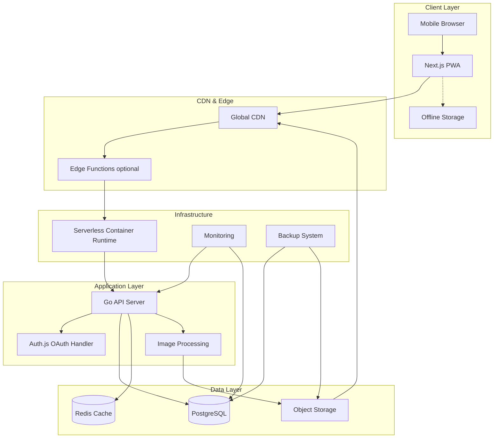
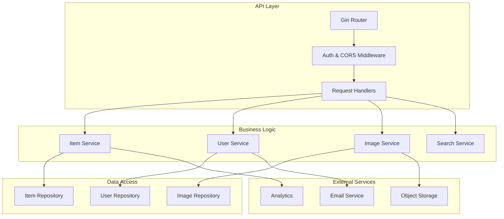
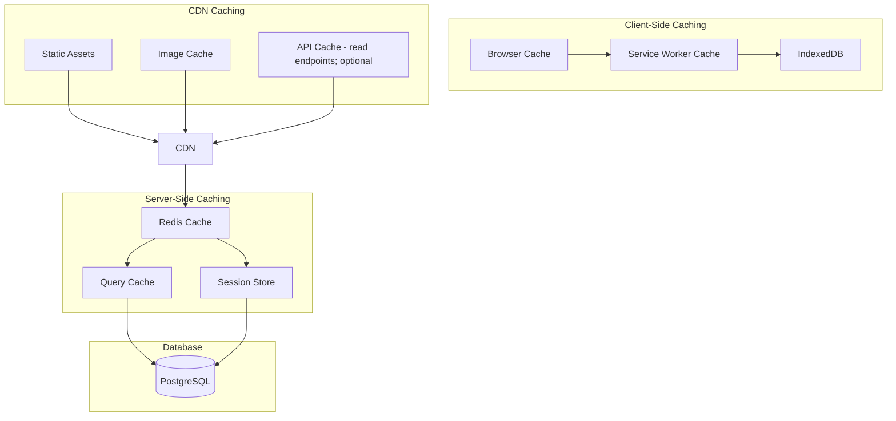
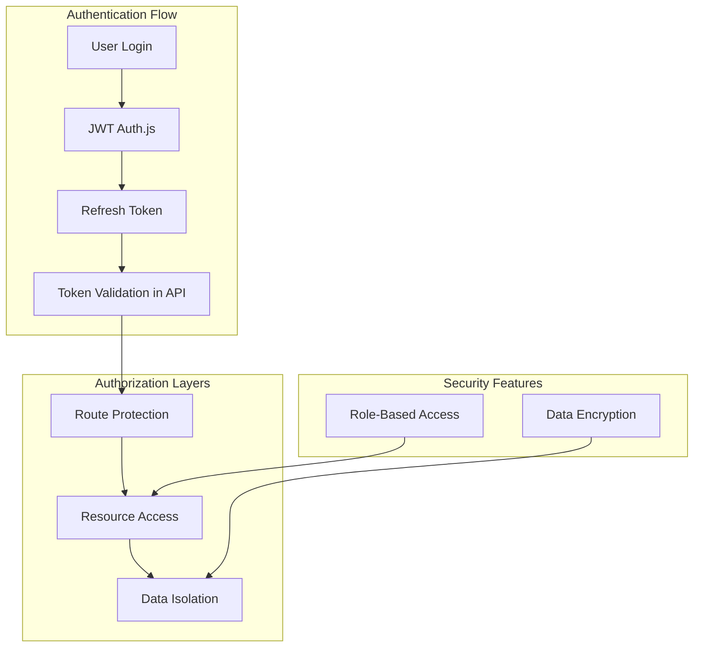

# Tracktory System Design

_Last Updated: September 4, 2025_

## System Overview

Tracktory is a mobile-first asset tracking platform built with Next.js frontend and Go backend, designed for sub-2-second load times and offline-first functionality. The architecture supports progressive enhancement from individual user MVP to multi-tenant household management.

## Architecture Principles

### Core Design Principles

1. **Mobile-First Performance**: All architectural decisions prioritize mobile device constraints
2. **Offline-First**: Core functionality works without internet connectivity
3. **Progressive Enhancement**: Features scale gracefully from basic to advanced usage
4. **User Data Sovereignty**: Architecture enables complete user control over data
5. **Horizontal Scalability**: System designed for community growth and multi-tenant usage

### Performance Constraints

- **Page Load**: < 2 seconds on 3G connections
- **API Response**: < 200ms average for core operations
- **Bundle Size**: < 200KB initial JavaScript bundle
- **Image Optimization**: Automatic compression and progressive loading

---

## High-Level System Architecture



### Reference deployment mapping (non-normative)

This system design remains cloud-agnostic. For the current production deployment, components map as follows (see the Cloud Infrastructure Blueprint in [docs/infrastructure/architecture.md](../infrastructure/architecture.md)):

- Managed frontend hosting → Vercel (Next.js)
- Serverless container runtime → Google Cloud Run (Go API)
- Managed PostgreSQL → Neon
- Managed Redis (future) → Upstash
- Object storage (S3-compatible) → Cloudflare R2
- Global CDN/DNS → Cloudflare

---

## Component Architecture

### Frontend Architecture (Next.js PWA)


#### Key Frontend Components

**Next.js App Router Structure:**

```
app/
├── (auth)/
│   ├── login/
│   └── register/
├── dashboard/
│   ├── page.tsx          # Item grid view
│   ├── add/page.tsx      # Add item form
│   └── [id]/page.tsx     # Item detail
├── search/
│   └── page.tsx          # Search interface
└── layout.tsx            # Root layout with PWA manifest
```

**State Management Strategy:**

- **Zustand**: Global state for user data and app settings
- **TanStack Query**: Server state management with caching
- **Local Storage**: Offline data persistence and user preferences

**Performance Optimizations:**

- **Code Splitting**: Route-based and component-based splitting
- **Image Optimization**: Next.js Image component with custom loader
- **Lazy Loading**: Progressive component loading with Suspense
- **Service Worker**: Aggressive caching and offline functionality with sync queue
- **Offline Support**: IndexedDB with conflict resolution and background sync (see [Offline Support Spec](./implementation-specs/offline-support.md))

### Backend Architecture (Go API)



#### Go Service Architecture

**Directory Structure:**

```
cmd/
├── api/
│   └── main.go           # API server entry point
├── migrate/
│   └── main.go           # Database migrations
internal/
├── handlers/             # HTTP request handlers
├── services/             # Business logic layer
├── repositories/         # Data access layer
├── models/              # Data models and DTOs
├── middleware/          # Authentication, logging, CORS
├── config/              # Configuration management
└── utils/               # Shared utilities
```

**Service Layer Design:**

- **Item Service**: CRUD operations, search, categorization
- **User Service**: Authentication, profile management, preferences
- **Image Service**: Upload, processing, optimization, CDN integration
- **Search Service**: Full-text search, filtering, ranking

---

## Data Architecture

### Database Schema Design

Note: This section presents a conceptual model. The authoritative, single-source schema (DDL, indexes, triggers, and RLS policies) lives in [database schema spec](./implementation-specs/database-schema.md). Update that file first; this diagram should be kept consistent with it.


#### Database Design Decisions

**PostgreSQL Features Utilized:**

- **UUID Primary Keys**: Distributed-friendly, privacy-focused identifiers
- **JSONB Columns**: Flexible metadata storage for preferences and settings
- **Full-Text Search**: tsvector with weighted ranking (A: name, B: description, C: category)
- **Trigram Similarity**: pg_trgm for fuzzy matching and typo tolerance
- **Partial Indexes**: Performance optimization for common queries
- **Row Level Security**: Multi-tenant data isolation

### Image Storage Architecture


#### Image Optimization Strategy

**Upload Processing:**

- **Size Limits**: 10MB max upload, 2048px max dimension
- **Format Support**: JPEG, PNG, WebP input; WebP/AVIF output
- **Multiple Resolutions**: 150px (thumbnail), 800px (display), 1600px (detail)
- **Compression**: Automated quality optimization for file size

**Storage Organization:**

```
images/
├── originals/
│   └── {user_id}/{item_id}/{image_id}.{ext}
├── thumbnails/
│   └── {user_id}/{item_id}/{image_id}_thumb.webp
├── display/
│   └── {user_id}/{item_id}/{image_id}_800.webp
└── detail/
    └── {user_id}/{item_id}/{image_id}_1600.webp
```

#### Upload Strategy and Access Patterns

- **Direct-to-Object-Storage Uploads**: The client obtains a short-lived, scoped upload token or presigned URL from the API, then uploads directly to object storage. This reduces API bandwidth/latency and aligns with CDN delivery.
- **Server-side Post-Processing**: After upload, the API triggers synchronous processing in the Go API for MVP; consider asynchronous processing in future phases to improve throughput.
- **Access Control**: Derived assets (thumbnails/resized renditions) are publicly readable via CDN for fast UI. Originals are private by default; owners can download via time-limited signed URLs issued by the API. Avoid embedding original URLs directly in the UI.

---

## API Design

### RESTful API Structure


For complete endpoint contracts, request/response bodies, and error codes, see the authoritative [API specification](./implementation-specs/api-specification.md).

#### API Response Standards

Standard success and error formats are defined in the [API specification](./implementation-specs/api-specification.md).

---

## Performance Architecture

### Caching Strategy



#### Caching Levels

**Browser/PWA Caching:**

- **Static Assets**: 1 year cache with versioning
- **API Responses**: 5 minutes for item lists, 1 hour for categories
- **Images**: Permanent cache with URL-based invalidation
- **Offline Queue**: IndexedDB for offline actions

**CDN Caching:**

- **Static Assets**: Global distribution with edge caching
- **Images**: Optimized delivery with format negotiation
- **API Responses**: Regional caching for read-only endpoints (enabled when API is placed behind CDN/proxy). Initial deployment runs DNS-only; switching to proxied caching is a manual operational step.

**Redis Caching:**

- **User Sessions**: 24-hour TTL with sliding expiration
- **Frequent Queries**: Category lists, user preferences
- **Search Results**: 15-minute TTL for common searches
- **Rate Limiting**: Request counting and throttling

### Database Optimization

**Query Optimization:**

- **Prepared Statements**: All queries use prepared statements
- **Connection Pooling**: Optimized connection management
- **Read Replicas**: Separation of read/write workloads (future)
- **Partitioning**: Date-based partitioning for history tables (future)

**Performance Monitoring:**

- **Query Performance**: Automatic slow query detection
- **Index Usage**: Regular index utilization analysis
- **Connection Metrics**: Pool utilization and wait times
- **Lock Monitoring**: Deadlock detection and resolution

---

## Security Architecture

### Authentication & Authorization



#### Security Implementation

**Authentication:**

- **OAuth Providers**: Google and GitHub authentication via Auth.js (NextAuth.js) on the frontend hosting platform.
- **JWT Tokens**: Short-lived access tokens (≈15 minutes) issued by Auth.js for API access.
- **Refresh Tokens**: Long-lived refresh tokens (≈7 days) with rotation, managed by Auth.js.
- **API Verification**: The Go API validates Auth.js-issued JWTs via the configured signing key/secret or JWKS, and enforces scopes/claims per route.
- **Secure Storage**: Auth.js handles secure session storage on the frontend; tokens are transmitted to the API over TLS only.
- **No Passwords**: OAuth-only authentication, no password storage in the API.
- **Token Transport**: The frontend sends the access token using the `Authorization: Bearer <token>` header on API requests (no cross-site cookies required).

**Token signing strategy:**

- MVP recommendation: Symmetric signing (HS256) with a shared secret between Auth.js and the Go API (for example, `AUTH_SECRET`/`NEXTAUTH_SECRET`). Keep tokens short-lived and rotate secrets periodically.
- Future option: Asymmetric signing (RS256/ES256) with a published JWKS endpoint; the API verifies via JWKS, avoiding a shared symmetric secret.

**Authorization:**

- **Resource Ownership**: Users can only access their own data
- **Household Permissions**: Role-based access for shared households
- **API Rate Limiting**: Planned per-user throttling backed by managed Redis; disabled for MVP
- **Input Validation**: Comprehensive request validation in handlers and schema validation in the API

**CORS Policy (API):**

- Allowed origins: `https://tracktory.tonyneuhold.com` and local development (e.g., `http://localhost:3000`).
- Allowed methods: GET, POST, PUT, PATCH, DELETE, OPTIONS
- Allowed headers: Authorization, Content-Type, X-Requested-With
- Credentials: Not required (Authorization header is used); set `Access-Control-Allow-Credentials: false`.

**Data Protection:**

- **Encryption at Rest**: Database encryption for sensitive data
- **Encryption in Transit**: TLS 1.3 for all communications
- **Password Security**: bcrypt hashing with appropriate cost
- **PII Handling**: Minimal collection and secure processing

---

## Deployment Architecture

### Deployment Strategy (cloud-agnostic)

This section describes abstract runtime responsibilities without provider specifics. For concrete production mapping, see the Cloud Infrastructure Blueprint and Deployment Guide:

- [Cloud Infrastructure Blueprint](../infrastructure/architecture.md)
- [Deployment Guide (Prod)](../infrastructure/deployment-guide.md)
- [Runtime Packaging (implementation spec)](./implementation-specs/runtime-packaging.md)

Core responsibilities:

- Frontend hosting builds and serves the Next.js app with global CDN.
- API runtime executes the Go service with autoscaling and health-checked rollouts.
- CI/CD runs tests and deploys both frontend and API; secrets are managed in environment/repo scopes.
- DNS/CDN route traffic to frontend and API; API proxy/caching for read endpoints can be enabled later as usage grows (manual switch).

---

## Monitoring & Observability

### Monitoring Stack


#### Key Metrics

**Performance Metrics:**

- **Response Time**: API endpoint response times (p50, p95, p99)
- **Page Load**: Frontend page load times
- **Database**: Query performance and connection metrics
- **Cache**: Hit rates and response times

**Business Metrics:**

- **User Activity**: Daily/monthly active users
- **Feature Usage**: Item creation, search usage, photo uploads
- **Performance Budget**: Mobile performance score tracking
- **Error Rates**: Application errors and user-reported issues

---

## Evolution & Migration Strategy

### Phase Evolution Architecture


#### Migration Strategies

**Database Evolution:**

- **Schema Migrations**: Automated, reversible database migrations
- **Data Migrations**: Careful data transformation with rollback plans
- **Performance Testing**: Load testing before and after migrations
- **Zero-Downtime**: Blue-green deployments for major changes

**Feature Flag Management:**

- **Gradual Rollout**: New features behind feature flags
- **Rollback Capability**: Instant feature disabling if needed

**Scaling Considerations:**

- **CDN Expansion**: Global content delivery optimization
- **Caching Layers**: Additional caching tiers for scale; enable CDN/proxy in front of API read endpoints when usage warrants it
- **Service Decomposition**: If needed, move from single serverless API to multiple services or managed Kubernetes

---

## Technical Debt Management

### Code Quality Standards

**Frontend Standards:**

- **TypeScript**: Strict type checking enabled
- **ESLint/Prettier**: Automated code formatting and linting
- **Testing**: 80%+ test coverage requirement
- **Performance**: Lighthouse score monitoring

**Backend Standards:**

- **Go Modules**: Dependency management and versioning
- **golangci-lint**: Comprehensive Go linting
- **Testing**: Unit and integration test requirements
- **Documentation**: Godoc for all public APIs

**Architecture Debt Tracking:**

- **ADR Documentation**: Architectural Decision Records for major choices
- **Technical Debt Backlog**: Dedicated tracking and prioritization
- **Refactoring Cycles**: Regular technical debt reduction sprints
- **Performance Regression**: Automated detection and alerts

---

This system design provides a comprehensive foundation for building Tracktory according to the strategic vision while addressing the key architectural concerns around performance, scalability, and user experience. The design emphasizes mobile-first performance while planning for future community and household features.
