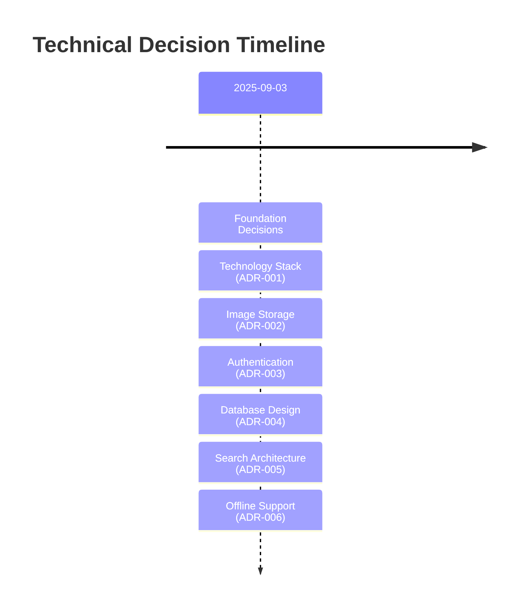

# Tracktory Technical Decisions Index

_Last Updated: September 3, 2025_

## Overview

This document serves as an index to all Architectural Decision Records (ADRs) for the Tracktory system. Each ADR captures a significant technical decision, providing context, alternatives considered, and rationale for the choice made.

## Purpose of ADRs

ADRs help us:

- **Document Decision Context**: Capture the circumstances that led to a decision
- **Record Alternatives**: Remember what options were considered and why they were rejected
- **Share Knowledge**: Help team members understand past decisions and their reasoning
- **Enable Evolution**: Provide a foundation for revisiting decisions as requirements change

## ADR Status Definitions

- **Proposed**: Under consideration, not yet decided
- **Accepted**: Decision has been made and is being implemented
- **Deprecated**: No longer recommended, but may still be in use
- **Superseded**: Replaced by a newer decision

## Current ADRs

<!-- prettier-ignore -->
| ADR | Title | Status | Date | Summary |
|-----|-------|--------|------|---------|
| [ADR-001](./technical-decisions/adr-001-technology-stack.md) | Technology Stack Selection | Accepted | 2025-09-03 | Next.js + Go + PostgreSQL stack for mobile-first performance |
| [ADR-002](./technical-decisions/adr-002-image-storage.md) | Image Storage and Processing | Accepted | 2025-09-03 | Object storage with CDN and multi-resolution processing |
| [ADR-003](./technical-decisions/adr-003-authentication.md) | Authentication and Session Management | Accepted | 2025-09-03 | JWT with refresh tokens and Redis session management |
| [ADR-004](./technical-decisions/adr-004-database-design.md) | Database Schema for Multi-Tenancy | Proposed | 2025-09-03 | Single database with row-level security for evolution to households |
| [ADR-005](./technical-decisions/adr-005-search-architecture.md) | Search Architecture and Performance | Proposed | 2025-09-03 | PostgreSQL full-text search with evolution path to Elasticsearch |
| [ADR-006](./technical-decisions/adr-006-offline-support.md) | Offline Support and Data Sync | Proposed | 2025-09-03 | PWA with IndexedDB and conflict resolution strategies |

## ADR Categories

### **Core Technology Decisions**

- [ADR-001: Technology Stack Selection](./technical-decisions/adr-001-technology-stack.md)
- [ADR-004: Database Schema for Multi-Tenancy](./technical-decisions/adr-004-database-design.md)

### **User Experience & Performance**

- [ADR-002: Image Storage and Processing](./technical-decisions/adr-002-image-storage.md)
- [ADR-005: Search Architecture and Performance](./technical-decisions/adr-005-search-architecture.md)
- [ADR-006: Offline Support and Data Sync](./technical-decisions/adr-006-offline-support.md)

### **Security & Authentication**

- [ADR-003: Authentication and Session Management](./technical-decisions/adr-003-authentication.md)

## Decision Timeline



## Key Architectural Principles

Based on our ADRs, these principles guide our technical decisions:

1. **Mobile-First Performance**: All technology choices prioritize mobile device constraints and performance
2. **Progressive Enhancement**: Features and architecture designed to evolve from simple to complex use cases
3. **User Data Sovereignty**: Architecture enables complete user control over their data
4. **Operational Simplicity**: Prefer proven technologies and simple operational patterns
5. **Security by Design**: Security considerations integrated throughout the architecture

## Future ADR Topics

Areas we anticipate making decisions about:

- **Real-time Collaboration**: WebSocket implementation for household features
- **Microservices Evolution**: Service decomposition strategy as team grows
- **Advanced Analytics**: User behavior tracking and performance insights

## ADR Template

When creating new ADRs, use this structure:

```markdown
# ADR-XXX: [Title]

**Date**: YYYY-MM-DD  
**Status**: [Proposed|Accepted|Deprecated|Superseded]  
**Context**: Brief description of the situation requiring a decision.

## Decision

Clear statement of the decision made.

## Rationale

Reasoning behind the decision, including benefits and trade-offs.

## Alternatives Considered

Other options that were evaluated and why they were rejected.

## Consequences

Both positive and negative outcomes expected from this decision.

## Implementation Notes

Specific guidance for implementing this decision (if applicable).
```

---

_This index is maintained as ADRs are added, updated, or superseded. Each ADR represents a significant architectural decision that shapes how we build Tracktory._
