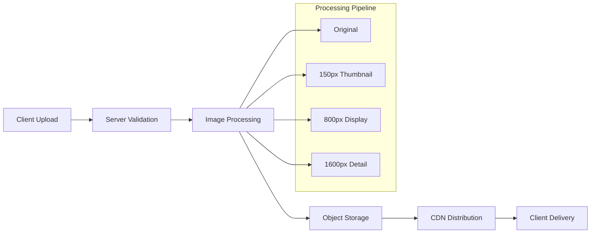

# ADR-002: Image Storage and Processing Architecture

**Date**: September 3, 2025  
**Status**: Accepted  
**Context**: Need efficient image handling for user-uploaded photos with mobile-optimized delivery.

## Decision

**Storage**: Object storage (S3-compatible) with CDN distribution  
**Processing**: Server-side processing with multiple resolution generation  
**Formats**: WebP/AVIF output with fallbacks  
**Delivery**: Progressive loading with responsive images

## Architecture



## Rationale

### Object Storage Benefits

- **Scalability**: Virtually unlimited storage capacity
- **Cost Efficiency**: Pay-per-use pricing model
- **CDN Integration**: Direct integration with content delivery networks
- **Durability**: Built-in redundancy and backup capabilities

### Multi-Resolution Strategy

- **Performance**: Smaller images for list views and thumbnails
- **Quality**: High-resolution available for detailed viewing
- **Bandwidth**: Reduced data usage on mobile connections
- **User Experience**: Faster loading with progressive enhancement

### Format Optimization

- **WebP/AVIF**: Superior compression with quality retention
- **Fallbacks**: JPEG fallbacks for older browser support
- **Automatic Detection**: Content negotiation based on browser capabilities

## Implementation Details

### Processing Pipeline

```go
type ImageProcessor struct {
    storage     ObjectStorage
    cdn         CDNProvider
    resolutions []Resolution
}

type Resolution struct {
    Name   string
    Width  int
    Height int
    Quality int
}

func (p *ImageProcessor) ProcessUpload(image io.Reader) (*ProcessedImage, error) {
    // 1. Validate image type and size
    // 2. Generate multiple resolutions
    // 3. Optimize formats (WebP/AVIF)
    // 4. Upload to object storage
    // 5. Update CDN cache
    // 6. Return image metadata
}
```

### Storage Structure

```
images/
├── {user_id}/
│   └── {item_id}/
│       ├── {image_id}_original.jpg
│       ├── {image_id}_thumb.webp
│       ├── {image_id}_display.webp
│       └── {image_id}_detail.webp
```

## Alternatives Considered

- **Database BLOB Storage**: Rejected due to backup complexity and CDN integration challenges
- **File System Storage**: Rejected due to scaling limitations and redundancy concerns
- **Third-Party Services** (Cloudinary): Rejected due to cost and vendor lock-in concerns

## Consequences

### Positive

- Excellent mobile performance with optimized images
- Scalable storage without infrastructure management
- Global content delivery through CDN
- Cost-effective at scale

### Negative

- Additional complexity in image processing pipeline
- Dependency on external storage provider
- Initial setup complexity for CDN integration

## Implementation Notes

- Use image processing libraries that support WebP/AVIF generation
- Implement progressive image loading on the frontend
- Set up CDN with appropriate cache headers for different image types
- Monitor storage costs and implement cleanup for deleted items
