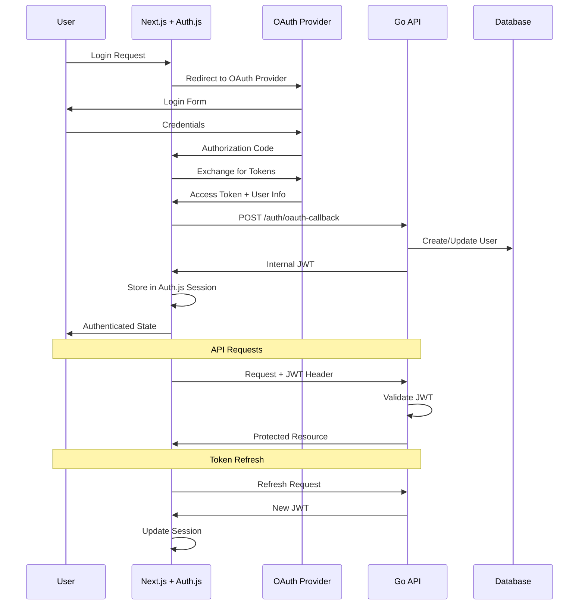

See the [technical decision index for all ADRs](../technical-decisions.md)

# ADR-003: Authentication and Session Management

**Date**: September 3, 2025  
**Status**: Accepted  
**Context**: Need secure, mobile-friendly authentication with offline capability support for Next.js frontend and Go backend.

## Decision

**Frontend**: Auth.js (NextAuth.js) for OAuth session management  
**Backend**: Custom Go JWT validation with shared secret  
**Token Strategy**: JWT access tokens from OAuth providers with refresh token rotation  
**Storage**: Auth.js handles secure storage, Go validates tokens  
**OAuth Providers**: Google and GitHub for authentication (no password storage)

## Architecture

## Implementation Strategy

See the [API specification](../implementation-specs/api-specification.md) for the exact auth-related endpoints, JWT structure expectations, and error formats. ADR-003 defines the decision and architecture; the spec defines the contracts.

### Frontend (Next.js + Auth.js)

See the [Authentication Implementation Spec](../implementation-specs/authentication.md) for complete Auth.js setup and callbacks.

### Backend (Go) - OAuth Callback Handler

See the [Authentication Implementation Spec](../implementation-specs/authentication.md) for the handler and middleware examples.

### User Database Schema

User table DDL and entity shape are defined in the [database schema spec](../implementation-specs/database-schema.md).

### JWT Validation Middleware

Middleware example lives in the [Authentication Implementation Spec](../implementation-specs/authentication.md).

## Rationale

### OAuth-Only Benefits

- **No Password Storage**: Eliminates password-related security risks entirely
- **Reduced Attack Surface**: No password reset flows, hash management, or credential validation
- **Better User Experience**: Users can use existing accounts they trust
- **Simplified Implementation**: No need for password validation, hashing, or reset flows
- **Enterprise Ready**: Many organizations prefer OAuth for SSO integration

### Auth.js Benefits

- **Production Ready**: Battle-tested authentication library
- **Developer Experience**: Excellent TypeScript support and documentation
- **Security**: Built-in CSRF protection, secure session handling
- **Next.js Integration**: First-class App Router support

### Hybrid Approach Benefits

- **Frontend Simplicity**: Auth.js handles complex auth flows
- **Backend Control**: Go API maintains full control over business logic
- **Scalability**: JWT tokens work across multiple backend instances
- **Security**: Shared secret validation with token expiration

### Custom JWT Claims

See [Authentication Implementation Spec](../implementation-specs/authentication.md).

## Implementation Simplifications

### What We Don't Need to Build

- **Password Hashing**: No bcrypt, Argon2, or other password hashing logic
- **Password Reset Flow**: No forgot password emails or reset tokens
- **Password Validation**: No complexity requirements or validation rules
- **Account Registration**: No email verification or account creation forms
- **Credential Storage**: No secure password storage in database
- **Rate Limiting**: OAuth providers handle brute force protection
- **Session Management**: Simplified token-only approach

## Alternative Authentication Solutions Considered

### Self-Hosted Solutions

- **Ory Kratos**: Rejected due to operational complexity for MVP
- **Keycloak**: Rejected due to heavyweight setup and Java dependency
- **Custom Password Auth**: Rejected due to security complexity and OAuth simplicity

### SaaS Solutions

- **Clerk**: Rejected due to vendor lock-in and cost concerns
- **Auth0**: Rejected due to complexity and pricing for our scale
- **Firebase Auth**: Rejected due to Google ecosystem dependency
- **Supabase Auth**: Considered but rejected due to vendor lock-in concerns and desire for infrastructure control

### Authentication Methods

- **Email/Password**: Rejected in favor of OAuth-only for security and simplicity
- **Magic Links**: Considered but OAuth provides better UX
- **Session-Only Auth**: Rejected due to mobile compatibility issues

## Consequences

### Positive

- **Reduced Development Time**: Auth.js handles complex authentication flows
- **Better Security**: Leverages battle-tested authentication patterns
- **Enhanced UX**: Seamless authentication with proper session management
- **Future-Proof**: Easy to add OAuth providers and advanced features
- **Mobile Compatible**: JWT tokens work well with PWA and future mobile apps
- **Scalable**: Stateless token validation across multiple API instances
- **Infrastructure Control**: Full control over database and backend logic
- **Cost Predictable**: No vendor lock-in or usage-based pricing concerns

### Negative

- **Additional Dependency**: Reliance on Auth.js for frontend authentication
- **Learning Curve**: Team needs to understand Auth.js patterns and configuration
- **Token Management**: Need to handle token refresh and storage properly
- **Complexity**: More moving parts than simple session-based authentication
- **Initial Setup Time**: Requires more upfront development compared to BaaS solutions

## Implementation Notes

### Required Environment Variables

See [Authentication Implementation Spec](../implementation-specs/authentication.md) for environment variables.

### Security Considerations

- **Shared Secret Management**: Use strong, randomly generated secrets
- **Token Expiration**: Keep access tokens short-lived (15 minutes)
- **Refresh Token Rotation**: Issue new refresh tokens on each use
- **Rate Limiting**: Implement login attempt throttling
- **HTTPS Only**: Always use HTTPS in production for token security

### Testing Strategy

- **Unit Tests**: Test JWT generation and validation logic
- **Integration Tests**: Test full authentication flows
- **Security Tests**: Test token expiration and revocation
- **E2E Tests**: Test user authentication journeys

## Decision Summary

After evaluating multiple authentication solutions including Supabase, the decision was made to proceed with **Auth.js + Go + PostgreSQL** to maintain:

- **Infrastructure Control**: Full control over database and backend logic
- **Cost Predictability**: No vendor lock-in or usage-based pricing concerns
- **Scalability**: Flexibility to optimize for our specific use cases
- **Team Learning**: Building expertise in foundational technologies

This approach provides the right balance of development efficiency through Auth.js while maintaining the flexibility and control needed for a growing asset tracking platform.
