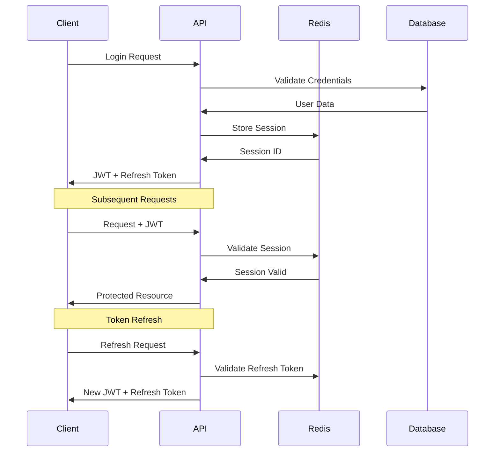

# ADR-003: Authentication and Session Management

**Date**: September 3, 2025  
**Status**: Accepted  
**Context**: Need secure, mobile-friendly authentication with offline capability support.

## Decision

**Token Strategy**: JWT access tokens with refresh token rotation  
**Storage**: HttpOnly cookies for web, secure storage for mobile  
**Session Management**: Redis-backed session store  
**Security**: bcrypt password hashing with appropriate cost factor

## Architecture



## Implementation

### JWT Configuration

```go
type JWTClaims struct {
    UserID    string `json:"user_id"`
    SessionID string `json:"session_id"`
    jwt.RegisteredClaims
}

const (
    AccessTokenTTL  = 15 * time.Minute
    RefreshTokenTTL = 7 * 24 * time.Hour
)
```

### Security Measures

- **Short-lived Access Tokens**: 15-minute expiration reduces exposure
- **Refresh Token Rotation**: New refresh token issued on each use
- **Session Invalidation**: Ability to revoke all user sessions
- **Rate Limiting**: Login attempt throttling and account lockout

## Rationale

### JWT Benefits

- **Stateless**: No server-side session storage required for validation
- **Mobile-Friendly**: Tokens work well with mobile app architecture
- **Scalable**: No shared session state between server instances
- **Flexible**: Can include custom claims for authorization

### Refresh Token Strategy

- **Security**: Limits exposure if access token is compromised
- **User Experience**: Seamless re-authentication without login
- **Offline Support**: Cached tokens work for offline usage
- **Revocation**: Ability to invalidate sessions server-side

## Alternatives Considered

- **Session Cookies Only**: Rejected due to mobile app complexity and CSRF concerns
- **OAuth2 Only**: Rejected due to additional complexity for MVP
- **Long-lived JWT**: Rejected due to security concerns with token revocation

## Consequences

### Positive

- Excellent mobile compatibility
- Strong security with refresh token rotation
- Scalable across multiple server instances
- Support for offline functionality

### Negative

- Additional complexity with token management
- Redis dependency for session management
- Potential token synchronization issues

## Implementation Notes

- Implement proper JWT signing and validation
- Set up Redis for session storage with appropriate TTL
- Use secure token storage on client side
- Implement automatic token refresh logic
- Add comprehensive rate limiting for authentication endpoints
