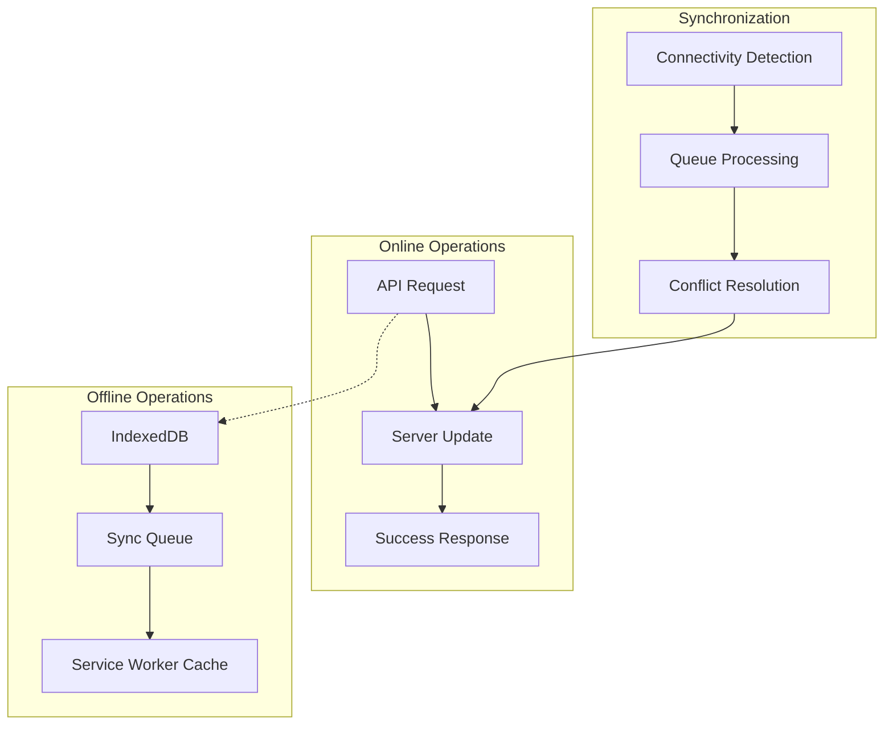

See the [technical decision index for all ADRs](../technical-decisions.md)

# ADR-006: Offline Support and Data Synchronization

**Date**: September 3, 2025  
**Status**: Accepted  
**Context**: Need offline capability for asset tracking in environments with poor connectivity.

## Decision

**Strategy**: Offline-first PWA with conflict resolution  
**Storage**: IndexedDB for client-side data persistence  
**Sync**: Queue-based synchronization with conflict detection  
**Resolution**: Last-write-wins with user notification for conflicts

## Architecture



## Implementation

Details for the offline data model, service worker caching, sync queue, and conflict resolution are specified in the [Offline Support Implementation Spec](../implementation-specs/offline-support.md). This ADR focuses on the decision and rationale; the spec is the source of truth for code-level contracts and examples.

## Conflict Resolution Strategy

### Conflict Detection

- **Version Timestamps**: Compare client and server timestamps
- **Checksum Comparison**: Detect concurrent modifications
- **User Notification**: Alert users to conflicts requiring resolution

### Resolution Approaches

```typescript
enum ConflictResolution {
  LAST_WRITE_WINS = "last_write_wins",
  USER_CHOICE = "user_choice",
  MERGE_CHANGES = "merge_changes",
}

interface ConflictData {
  clientVersion: any;
  serverVersion: any;
  conflictFields: string[];
  resolution: ConflictResolution;
}
```

## Rationale

### Offline-First Benefits

- **User Experience**: Seamless operation regardless of connectivity
- **Performance**: Immediate feedback for user actions
- **Reliability**: Data preserved during network outages
- **Mobile Optimization**: Reduced data usage and battery drain

### IndexedDB Choice

- **Storage Capacity**: Large storage limits compared to localStorage
- **Structured Data**: Support for complex data types and queries
- **Asynchronous**: Non-blocking database operations
- **Browser Support**: Excellent support across modern browsers

## Implementation Phases

### Phase 1: Basic offline support

- Cache static assets and core pages
- Store new items locally when offline
- Simple sync when connection restored

### Phase 2: Advanced synchronization

- Conflict detection and resolution
- Optimistic updates with rollback
- Background sync for failed operations

### Phase 3: Collaborative features

- Real-time sync for household sharing
- Operational transformation for concurrent edits
- Conflict resolution UI for complex scenarios

## Alternatives Considered

- **Full Online-Only**: Rejected due to mobile usage patterns and unreliable connectivity
- **Native Mobile Apps**: Rejected due to development complexity and web-first strategy
- **Third-Party Sync Services**: Rejected due to cost and vendor lock-in concerns

## Consequences

### Positive

- Excellent user experience in offline scenarios
- Reduced server load through local caching
- Improved mobile performance and battery life
- Foundation for real-time collaborative features

### Negative

- Increased client-side complexity
- Potential data consistency challenges
- Storage management requirements
- Conflict resolution UX complexity

## Implementation Notes

- Implement robust service worker for caching strategy
- Set up IndexedDB with proper schema for offline data
- Create conflict resolution UI for user choices
- Monitor offline usage patterns and sync performance
- Test extensively with various connectivity scenarios
