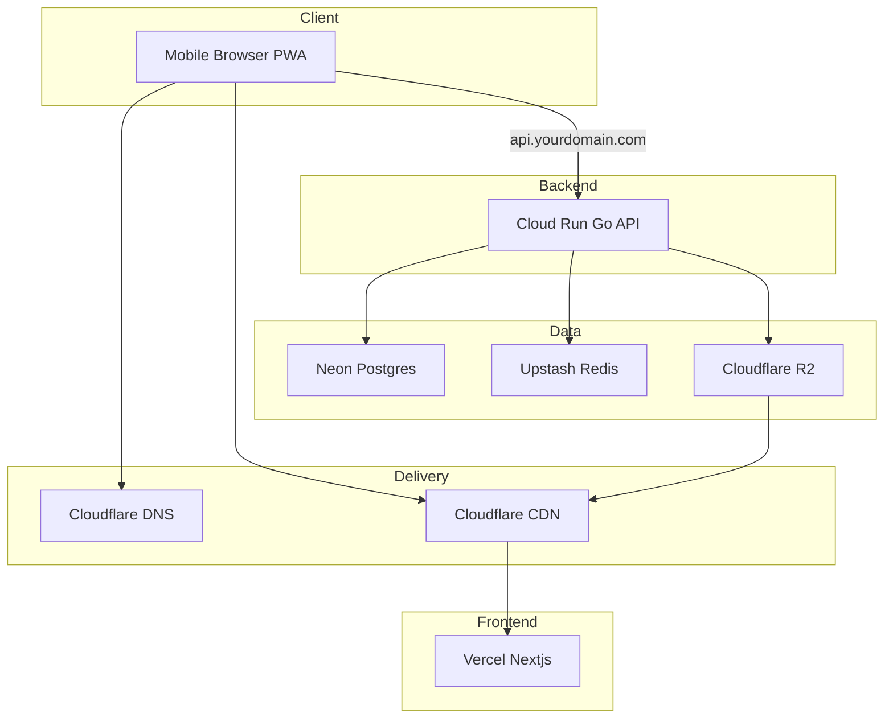

# Cloud Infrastructure Blueprint

Last Updated: 2025-09-03

Scope: Production-only, hobby-scale (1–2 users), <$50/month target. Simple, low-ops stack with room to grow.

Chosen Stack

- Frontend: Vercel (Next.js PWA)
- API: Google Cloud Run (Go container)
- Database: Neon Postgres (free tier)
- Cache/Rate limit/Queues (future): Upstash Redis (free tier)
- Images/Files: Cloudflare R2 object storage + Cloudflare CDN
- DNS + TLS: Cloudflare DNS (proxied where appropriate)
- CI/CD: GitHub Actions (tests + Cloud Run deploy), Vercel auto-deploy for frontend

High-level Architecture

Environment Matrix (now vs later)

- prod (now): single Cloud Run service, one Neon DB, one Upstash Redis, one R2 bucket.
- staging (later): mirror prod with smaller sizes; CI promotion flow.

SLO Targets (initial)

- API median < 200 ms, p95 < 750 ms under hobby load
- PWA TTI < 2s on mid-tier mobile with good network
- Availability best-effort; no auto multi-region (yet)

Networking & DNS

- Root and subdomains managed in Cloudflare.
- Frontend: `tracktory.tonyneuhold.com` (proxied through Cloudflare to Vercel).
- API: `api.tracktory.tonyneuhold.com` (CNAME to Cloud Run domain, start as non-proxied “DNS only” for simplicity; can add Cloudflare proxy later).
- Images: `cdn.tracktory.tonyneuhold.com` for R2 public access (via R2 custom domain or Worker; start with signed URLs if preferred).

Security (MVP posture)

- TLS via Cloudflare/Vercel/Cloud Run managed certs.
- GitHub Actions: repository/environment secrets (DB URL, Redis token, R2 credentials, API base URL).
- Service account for Cloud Run deploy (rotate yearly; later: move to OIDC/WIF).
- Principle of least privilege on Cloudflare API token (DNS edit + R2 access only).

Cost Notes (hobby)

- Vercel: free tier likely sufficient.
- Cloud Run: generous free; minimal cold starts acceptable.
- Neon: free tier.
- Upstash: free tier (monitor limits).
- Cloudflare: free DNS; R2 storage/requests minimal at MVP.

Evolution Path

- Add staging environment; promotion via GitHub Environments.
- Move API behind Cloudflare proxy with caching rules for read endpoints.
- Add autoscaling and basic error budgets; consider regional DR later.
- Optionally migrate API to managed K8s when multi-service complexity grows.
